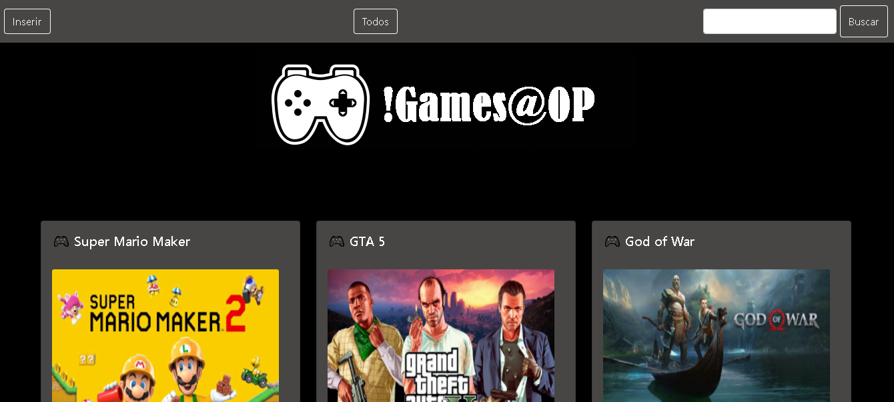
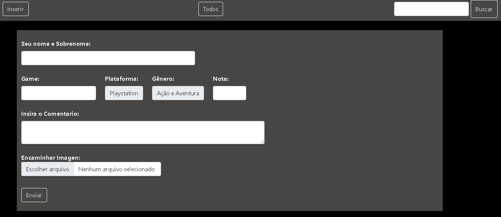
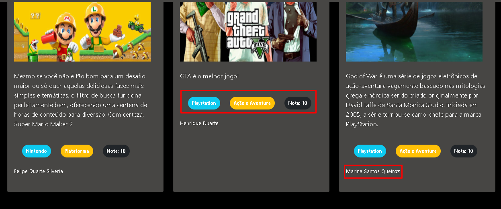

<h1>API_opinião</h1>

<h2>Requisitos</h2>

<i>- Node.js</i>

<h2> Instalação local</h2>

Dentro do diretorio, Deve ser feito a instalação das dependencias com o seguinte comando:

<i>- npm install;</i>

 

<h2>Iniciando servidor</h2>

Após isso, para iniciar, deve ser executado o arquivo app.js;

<i>- nodemon app.js;</i>

<h2> Orientações </h2>

- Por padrão, no arquivo "app.js" a aplicação estará configurada para escutar a porta 3000, podendo ser customizada caso a porta já esteja sendo utilizada;
 

<h3>Rotas</h3>

- / - Esta rota que deve chamar por "localhost:3000/", renderiza a pagina inicial onde é apresentado os comentarios em blocos; O menu statico acima tem as opções de Inserir, buscar todos e filtrar por plataforma; 

- /inserir - Pagina onde é apresentado o formulario para realizar um novo comnetario, onde todos os campos são obrigatorios, sendo tambem necessário enviar uma imagem para ilustrar o comentario.

- /postar - Ao enviar o comentario, sera acessado esta rota, onde sera feito a conexão com a API e encaminhar os parametros para cadastro, alem disso, passa pelo middleware multer para upload da imagem, que ira salvar a imagem com o "nome do usuario" + "game" + "nota";

 Ao postar, sera feito em bloco o comentario, onde ficará posicionado os dados preenchidos da seguinte forma:

<i> Projeto em constante mudança, avançando para melhoria e implementações de funcionalidas como: Delete de comentarios e buscas avançadas.</i>

